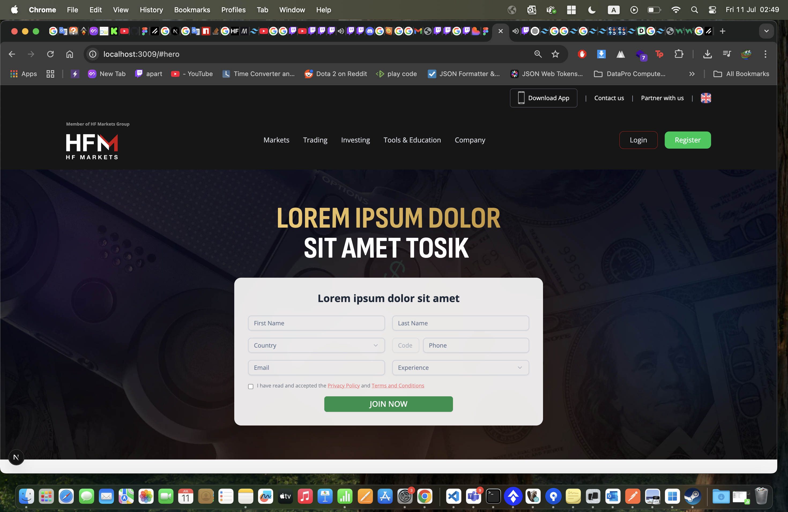
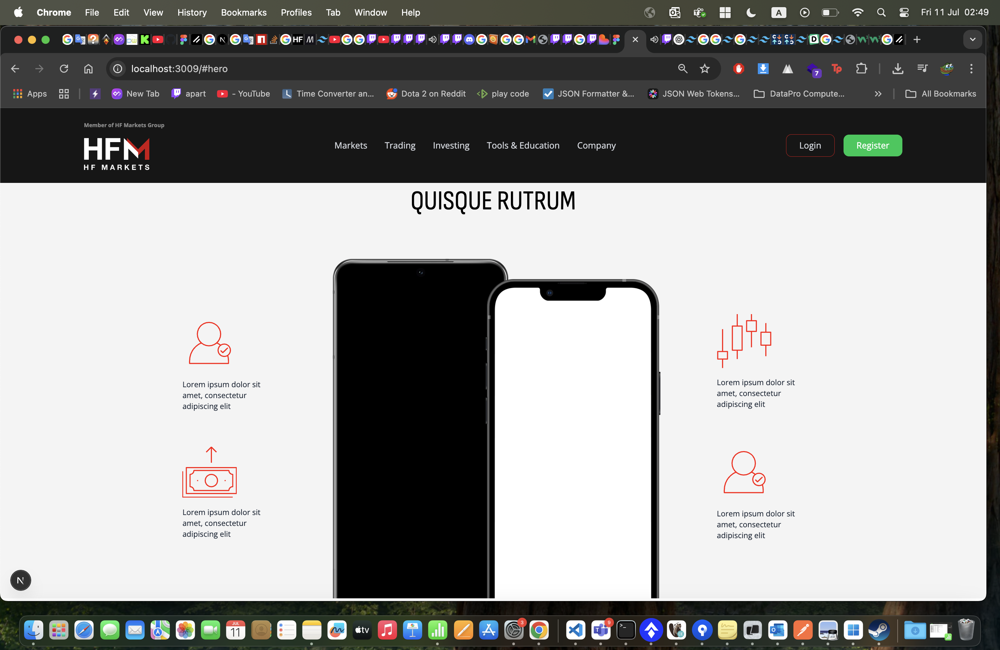
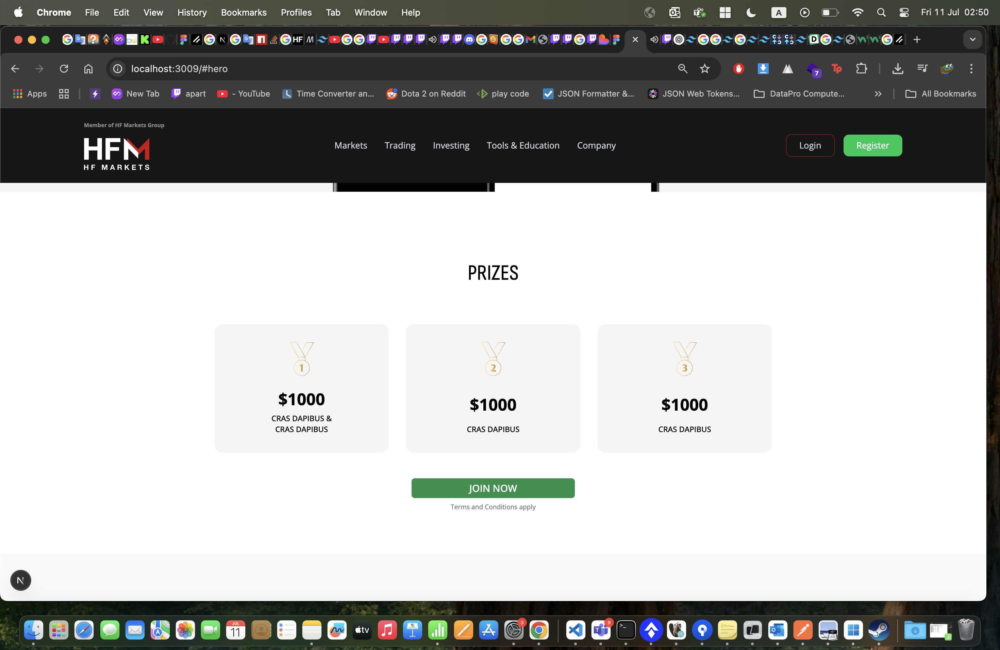
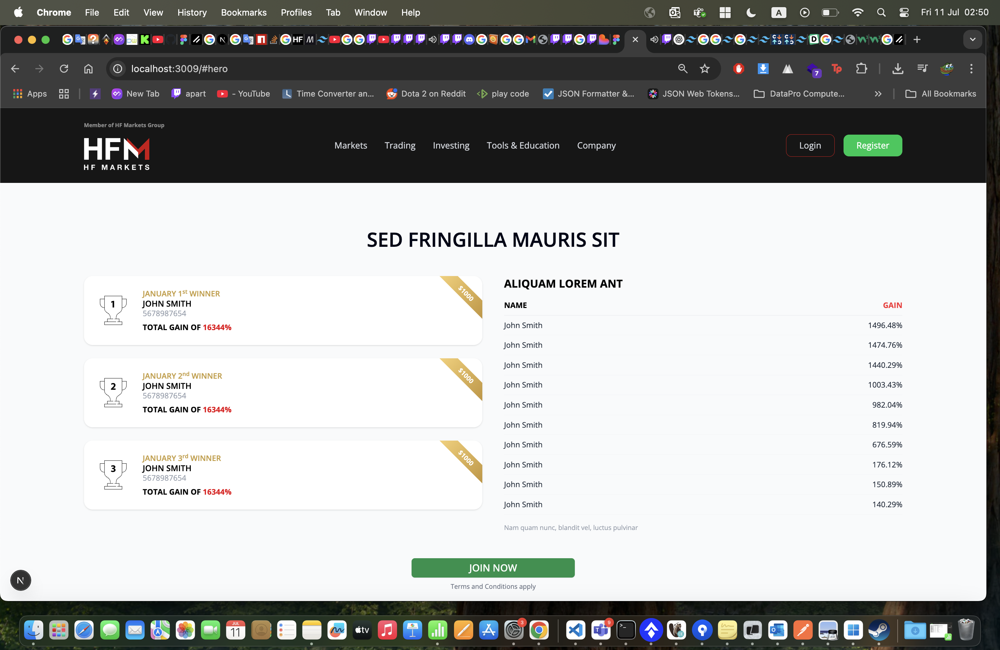
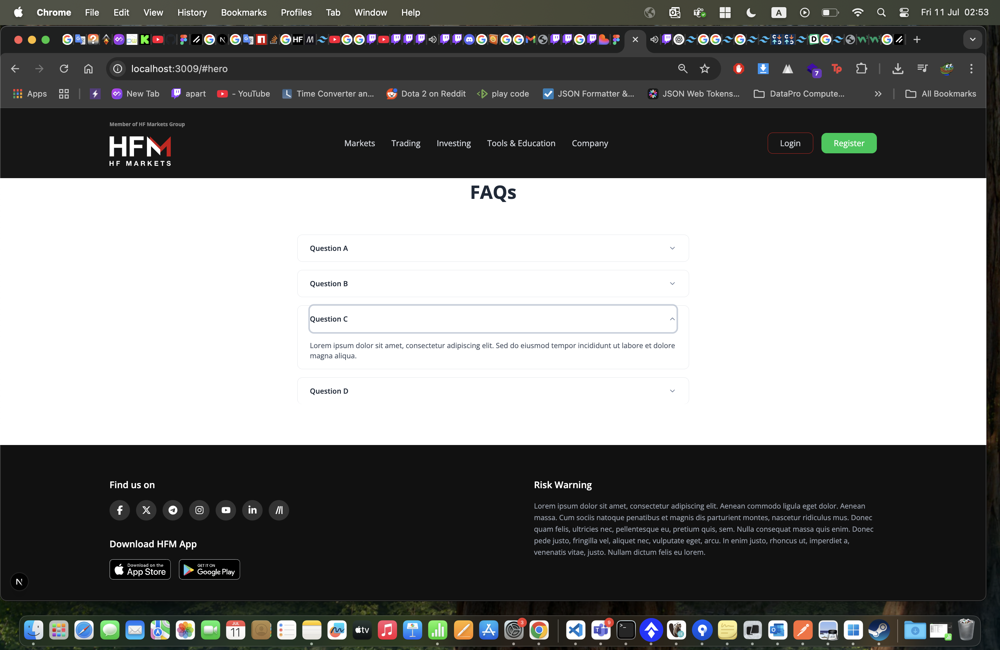

# HF Markets Landing Page Challenge

A responsive landing page built with **Next.js 15 App Router**, **Tailwind CSS**, and **ShadCN UI** – inspired by the provided Figma design for **HF Markets Group**.

## ✅ Completion Status

> 🎯 **~90% functional & visually aligned** with the Figma mockup.

Despite being a full-stack engineer with a backend focus, I implemented this page to match the design as closely as possible while ensuring usability, responsiveness, and clean code.

---

## 📸 Screenshots


| Hero | Features | Prizes | Leaderboard | FAQ |
|------|----------|--------|-------------|-----|
|  |  |  |  |  |


---

## 🛠️ Stack

- **Next.js 15 (App Router)**
- **React 19**
- **Tailwind CSS**
- **ShadCN UI**
- **Lucide Icons + React Icons**
- `scroll-behavior: smooth` (for navigation)
- Custom form with `react-hook-form` and validation

---

## 🔥 Features Implemented

- ✅ Sticky header with smooth scroll
- ✅ Hero section with phone mockup
- ✅ Feature grid and prize section
- ✅ Leaderboard with dynamic gain sorting + styled ribbon
- ✅ Working contact form
- ✅ faq section
- ✅ Responsive across devices
- ✅ Footer closely aligned with design (icons, layout, copy)

---

## ⚙️ Running Locally

```bash
npm install
npm run dev
```
